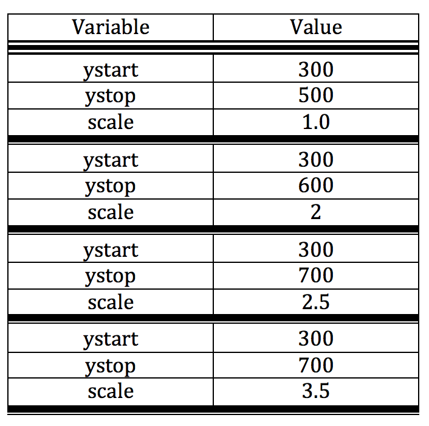

# Vehicle Detection

Overview
---

In this project, our goal is to write a software pipeline to detect vehicles in a video. Before testing the pipeline on a video, we first try to make sure our vehicle detection classifier works on images file. After that, we get each frame of the video and pass it to the pipeline. Pipline will return the output video along with the bounding boxes around each vehicle.   
 

Pipeline
---
*The pipeline along with the corresponding python codes will be described here.*

*Note: I have not included the training data in my submission, because my github repository has limited space.*

 

I. Perform a Histogram of Oriented Gradients (HOG) feature extraction on a labeled training set of images and train a classifier Linear SVM classifier.

* We can also applied a color transform and append binned color features, as well as histograms of color, to the HOG feature vector.

* Features has been normalized and selection of training and testing set was random.

* Data set was divided into two sets for training(80%) and testing(20%).

* Some of the parameters that were used during training are listed in the following table.

 

* Size of feature vector was 5772

* System was tested with different paramter combination that the current combination revealed the best testing accuracy. The following table shows the test accuracy for two cases.

 

 

 

II. Implementing a sliding-window technique and using the trained classifier to search for vehicles in images.

* Hog Sub-sampling Window Search technique was using for searching windows in the images.

* The top middle half of the images frames doesn't have any car to look for. As a result, we limit the search space into the bottom half of images. The search space then will be splited into sub-spaces in order to account for the size of the vehicles that we are looking for. Because vehicles in the nearer distance appear to be larger as a result we increase the window size that we are looking for by tweaking the variable `scale`. On the other hand, vehicles in the further distance tend to appear in the middle region of the pixels.

* Following table shows some of the combinations of `ystart`, `ystop`, and `scale` that were used during detection. `scale` is for the size of the window that we are looking for in the images. `ystart` and `ystop` are limits of the images that we are looking for pattern.

 

*

 

 

III. 

 

 

IV. 

 

 

V. 

 

 

VI. 

 

 

VII. 

 